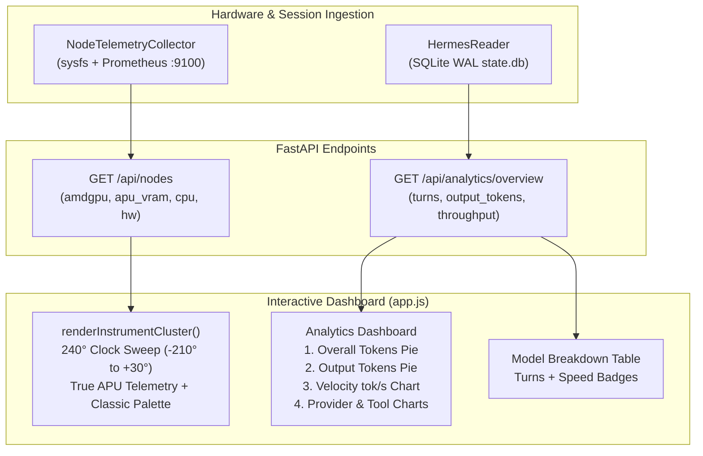

# Architectural Blueprint: Cluster Gauge & Token Velocity Refinements (SPEC-HK-005)

## Status
Accepted

## Context & Problem Statement
Direct user testing of HermesKarma after SPEC-HK-004 revealed three issues:
1. **0% Gauge Telemetry**: In `renderInstrumentCluster`, metrics were being referenced from `hw = n.hardware || {}` and `gpu = hw.gpu || {}`. Because `n.hardware.gpu` is a string description, `gpu.gpu_busy_percent`, `gpu.temperature_c`, etc., resolved to `undefined` and defaulted to 0.
2. **Neon Palette & Dial Alignment**: The monochromatic neon cyan styling obscured instrument hierarchy. Additionally, dial geometry had 0% starting at upper-left rather than the standard automotive layout (0% at lower-left, 50% at top, 100% at lower-right).
3. **Analytics Depth**: The Tokens & Cost view lacked granular output-token distribution, prominent turn counts, and inference throughput (tok/s) telemetry.

---

## Architecture & Data Flow



---

## Interface Contracts & Schemas

### 1. `GET /api/analytics/overview` Response Schema Enrichment
```typescript
interface ModelDistributionItem {
  model: string;
  session_count: number;
  api_call_count: number;
  turns_count: number; // New: Turn count per model
  input_tokens: number;
  output_tokens: number; // Dedicated output tokens
  cache_read_tokens: number;
  cost_usd: number;
  billing_provider: string;
  is_local: boolean;
  provider_category: string;
  throughput_tok_per_sec: number; // Measured / reference tok/s
  throughput_tier: "ultra" | "fast" | "standard" | "local_apu";
}
```

### 2. Radial Gauge Geometry Contract
- Center Point: $(cx, cy)$
- Radius: $r$
- Clock Angle: $\theta = -210^\circ + (P \times 2.4)^\circ$
- Needle Pivot: $(cx, cy)$
- Digital Readout Box: centered horizontally at $x = cx$, vertically positioned at $y = cy + r \times 0.75$ to $cy + r + 20$, guaranteed outside the needle rotation arc.

---

## 💡 Note to Future Self: Hosting Portability
- **Decoupled Throughput Engine**: The tok/s calculation leverages live telemetry from local node metrics (`llamacpp:predicted_tokens_seconds` via node exporter on Chunkito) when reachable, falling back gracefully to empirical benchmark baselines (`pantheon_benchmark_history.jsonl` / model rate cards).
- **Edge Resilience**: All radial gauges render completely in native SVG using clean trigonometric projections without heavy external charting libraries, maintaining 60fps performance on mobile, tablet, and low-power browsers.

## Implementation Guidance

### Phase 1: Backend & Data Contract
- Extend the `AnalyticsService.get_overview()` method to compute `total_turns` from `sessions` and `model_breakdown` entries.
- Enrich the data schema with `output_tokens` for each model.
- Ensure `throughput_tok_per_sec` is populated based on live metrics from `chunkito` (when available) or pre-recorded benchmarks.

### Phase 2: Gauge Redesign & Geometry Fix
- Update `renderInstrumentCluster(data)` in `app.js` to:
  - Use the correct object chain: `const gpu = data.amdgpu || {};`
  - Use `const apu = data.apu_vram || {};` and other telemetry objects.
  - Implement `theta(P)` and `needle_rotation(P)` functions using trigonometry.
  - Apply the classic automotive color gradients to the arc paths for each gauge.

### Phase 3: Tokens & Cost View Overhaul
- Create new UI components:
  - `#modelOutputChart` (Doughnut chart) for output tokens.
  - `#velocityChart` (Bar chart) for generation speed (tok/s).
- Add a `Turns` column in the model breakdown table.
- Implement a new hero KPI card in the Analytics tab showing total turned sessions.

### Phase 4: Verification & Automated Tests
- Write unit tests for new functions and data mapping logic.
- Verify SVG rendering accuracy using visual regression testing.
- Ensure all new metrics are correctly propagated through APIs to the frontend.
