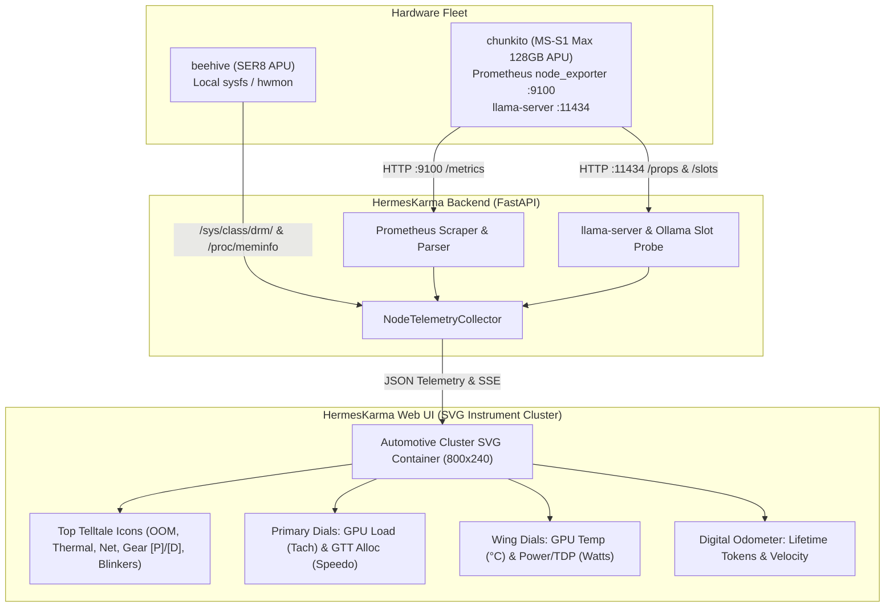

# Architecture Blueprint: Automotive Cluster Gauges for Fleet & APU Nodes

## 1. System Context & Overview
The APU & Fleet Node telemetry subsystem connects HermesKarma to local hardware (`beehive`) and remote heterogenous APU nodes (`chunkito` Strix Halo 128GB) over Tailscale. This architecture replaces the static 4-box tile display with a dynamic, automotive-grade digital instrument cluster rendered via vector graphics (SVG) with live hardware telemetry bindings.



---

## 2. Component Design & Rendering Pipeline

### 2.1 SVG Dial Geometry Specifications
```
[ Wing Left: Temp ]    [ Primary Left: GPU Core Load ]      [ Primary Right: GTT Memory ]    [ Wing Right: Power/TDP ]
(cx=60, cy=130, r=42)  (cx=260, cy=140, r=80)              (cx=540, cy=140, r=80)           (cx=740, cy=130, r=42)
  30°C - 100°C           0 - 100 % (Tachometer)              0 - 128 GB (Speedometer)         0 - 120 Watts
```

### 2.2 Telltale Warning Icons Matrix
| Icon / Glyph | Prometheus / Telemetry Metric | Normal State (Dim/Off) | Warning/Active State (Lit) | Color |
|:---|:---|:---|:---|:---|
| 🏎️ Gear `[P]` / `[D]` | `slot_summary.active_slots > 0` | `[P]` (Parked / Idle) | `[D]` (Drive / Generating) | Neon Blue `#00e5ff` |
| ⚡ Thermal Throttle | `node_cooling_device_cur_state > 0` | Extinguished | Lit (Amber/Red Flashing) | Amber `#ff9500` / Red `#ff3b30` |
| ⚠️ Check Engine / OOM | `node_vmstat_oom_kill > 0` | Extinguished | Lit (Solid Red) | Red `#ff3b30` |
| 🟢 Turn Blinkers | `active_tasks.length > 0` | Extinguished | Pulsing Neon Green | Green `#30d158` |
| 🌐 Tailscale Link | `node.status == "online"` | Dim Slate | Bright Cyan / High Beam | Blue `#007aff` / Cyan |

### 2.3 ADR: Vector SVG vs Canvas vs Third-Party Charting Library
- **Decision:** Implement using native scalable vector graphics (`SVG`) rendered directly in DOM templates, styled with Tailwind and CSS transitions.
- **Rationale:**
  - Zero external bundle dependencies (no heavy Chart.js/Echarts overhead).
  - Crisp pixel-perfect rendering across HiDPI/Retina screens.
  - Native SVG styling and drop-shadow glow filters (`feGaussianBlur`).
  - Seamless integration with existing vanilla JS architecture in `app.js`.

---

## 3. 💡 Note to Future Self: Hosting Portability
- **Prometheus Scraper Fallback:** If `chunkito` or a future cluster node does not run `node_exporter`, the collector seamlessly falls back to llama-server slot estimation and sysfs `/sys/class/drm/` metrics. The UI cluster automatically marks unavailable telemetry channels as disabled without breaking dial rendering.
- **Extensibility to Multi-GPU / Multi-Node:** The SVG cluster component is encapsulated in a pure generator function `renderInstrumentCluster(amdgpu, inference, hardware)` which can be instantiated for any number of local or remote nodes in the fleet.
