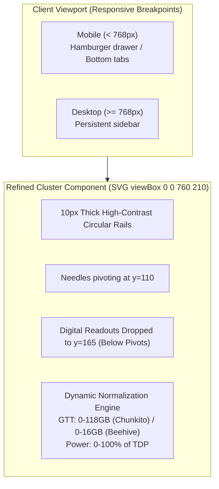

# Architecture Blueprint: Gauge Refinements & Mobile-Responsive Design (SPEC-HK-004)

## 1. System Context & Overview
This blueprint establishes the visual geometry and layout rules for the refined instrument cluster and responsive design across all viewports for HermesKarma.



---

## 2. Dial Layout & Needle Coordinates

### 2.1 Geometry Specifications
```
Left Wing (GPU Temp)     Primary Left (GPU Core Load)      Primary Right (GTT Allocation)     Right Wing (Power/TDP)
Center: (65, 110)        Center: (245, 110)                Center: (515, 110)                 Center: (695, 110)
Radius: 40px             Radius: 75px                      Radius: 75px                       Radius: 40px
Arc: -135° to -45°       Arc: -120° to +120°               Arc: -120° to +120°                Arc: 45° to 135°
Readout: y=165           Readout: y=165 (below pivot)      Readout: y=165 (below pivot)       Readout: y=165
```

### 2.2 ADR: Pure CSS & SVG Responsiveness vs JavaScript Resize Listeners
- **Decision:** Utilize vector `viewBox` scaling with Tailwind CSS responsive utilities (`hidden md:block`, `flex md:hidden`, `grid-cols-1 sm:grid-cols-2 lg:grid-cols-4`).
- **Rationale:** Prevents layout jitter, runs on GPU compositing layers, and ensures instant fluid resizing without JavaScript thread overhead.

---

## 3. 💡 Note to Future Self: Hosting Portability
- **Touch-Friendly Controls:** All clickable action elements in mobile views maintain minimum $44 \times 44\text{px}$ touch targets per WCAG 2.1 guidelines.
- **Node Scale Config:** Max GTT and TDP limits dynamically adapt based on the node's `hardware` configuration payload from `api/config.py`, requiring zero hardcoded IP assumptions.
