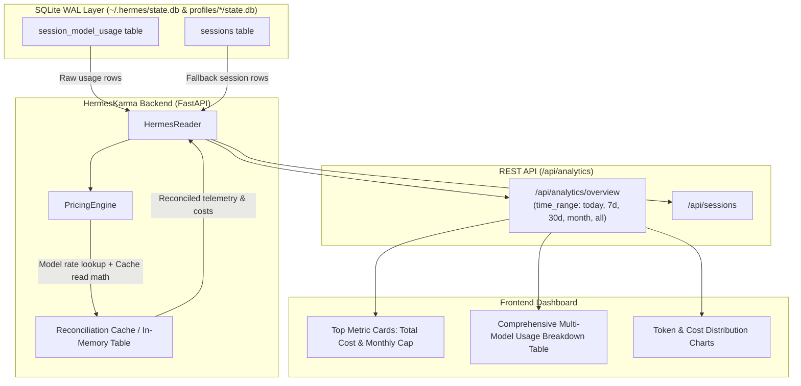

# Architecture Blueprint: HermesKarma Dynamic Cost Estimation & Frontier Pricing Engine

## 1. System Context & Overview
HermesKarma monitors and aggregates telemetry across local APU hardware (Chunkito Strix Halo 128GB, Beehive SER8) and cloud providers (Google Gemini, Anthropic, OpenAI, DeepSeek). This subsystem reconciles SQLite WAL anomalies where historical cloud sessions recorded `$0.00` due to missing pricing definitions, and provides dynamic per-model reconciliation, cache-aware pricing, and monthly spend cap tracking.



---

## 2. Component Architecture & Data Contracts

### 2.1 PricingEngine Contract (`api/services/pricing_engine.py`)
```python
class ModelPricing(NamedTuple):
    input_per_million: float
    output_per_million: float
    cache_read_per_million: float = 0.0
    cache_write_per_million: float = 0.0
    tier_threshold_tokens: Optional[int] = None
    input_per_million_above: Optional[float] = None
    output_per_million_above: Optional[float] = None
    cache_read_per_million_above: Optional[float] = None
    is_local: bool = False

class UsageCostEstimate(NamedTuple):
    cost_usd: float
    is_reconciled: bool
    is_local: bool
    pricing_source: str
```

### 2.2 ADR: Dynamic Evaluation vs Physical WAL Mutation
- **Context:** `~/.hermes/state.db` is opened in read-only mode (`?mode=ro` with `PRAGMA query_only = ON;`) to prevent locking against the live Hermes Agent runtime.
- **Decision:** Do NOT execute physical write updates to `state.db`. HermesKarma's backend computes reconciled costs on the fly during ingestion and queries.
- **Consequence:** Zero lock contention with Hermes Agent WAL writers. Real-time accuracy is guaranteed even when historical WAL records contain `0.0`.

---

## 3. Structural Interface & Endpoints
- `GET /api/analytics/overview?time_range={all|month|30d|7d|today}`:
  - `total_estimated_cost_usd`: Float
  - `raw_stored_cost_usd`: Float
  - `reconciled_delta_usd`: Float
  - `current_month_cost_usd`: Float
  - `spend_cap_usd`: Float (Default: 250.0)
  - `spend_cap_pct`: Float
  - `models`: List of model objects with `cost_usd`, `reconciled`, `is_local`.

---

## 4. 💡 Note to Future Self: Hosting Portability
- **Cloud/Edge Decoupling:** The pricing engine maintains static defaults for frontier models and does not require external internet calls during telemetry queries. If Hermes is deployed in an air-gapped homelab or disconnected environment, local models resolve cleanly to `$0.00` without stalling on external metadata endpoints.
- **Custom Overrides:** Rate overrides can be optionally mounted via `~/.hermes_karma/pricing_overrides.json` without modifying code or restarting systemd daemons.
