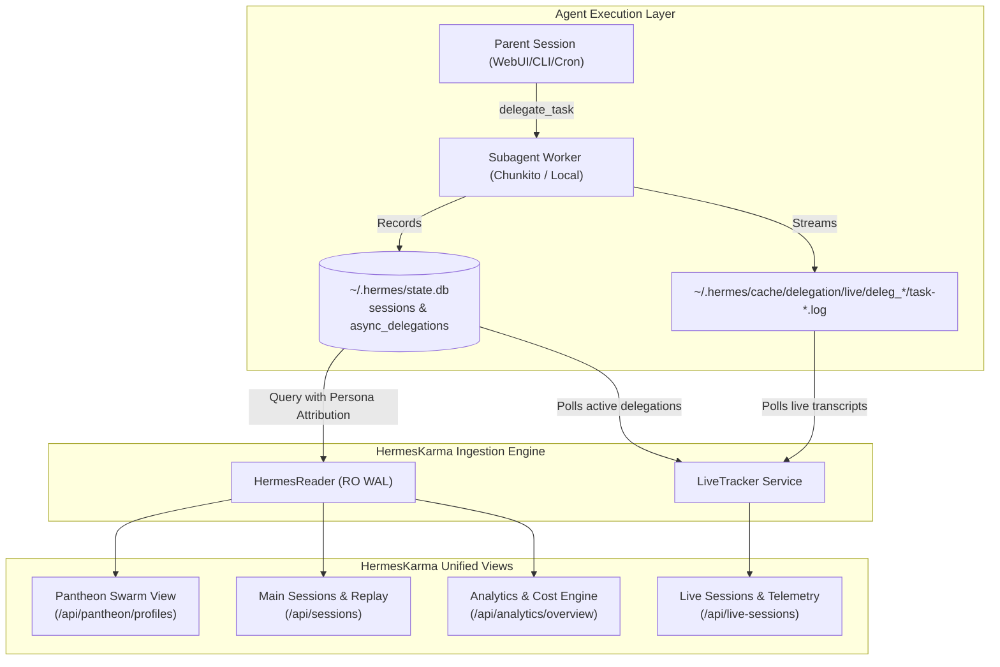

# ADR & Architecture Blueprint: Pantheon Swarm Telemetry & Multi-View Tracking

## Status
Accepted

## Context
The Hundred Acre Wood Pantheon Swarm distributes reasoning and execution across specialized agent personas (`@owl`, `@rabbit`, `@tigger`, `@piglet`, `@eeyore`, `@pooh`, `@coder`, `@ingest`). When running swarm workflows, subagents are dynamically spawned via `delegate_task` to local hardware (`chunkito` APU with `qwen3.8-flash-next:262k`).
Previously, HermesKarma only counted standalone sessions with isolated `profile_name` or `~/.hermes/profiles/<id>/state.db`. Because delegated subagents execute from parent sessions under `profile_name = 'default'`, HermesKarma reported 0 sessions, 0 tokens, and 0 activity for Tigger and other swarm workers.

## Decision & Multi-View Architecture

### 1. Persona Attribution Logic
Sessions and subagent delegations are attributed to Pantheon swarm agents via a 3-tier cascade:
1. **Tier 1 (Explicit Profile):** Direct match on `sessions.profile_name = p_id` or profile database `~/.hermes/profiles/{p_id}/state.db`.
2. **Tier 2 (Explicit Mention / Goal Tag):** Subagent delegation task json or session title/goal containing `@<persona>` or `<persona>` name (e.g. `@tigger`, `@piglet`, `@eeyore`, `@pooh`, `@owl`, `@rabbit`, `@coder`, `@ingest`).
3. **Tier 3 (Model & Role Assignment):**
   - `qwen3.8-flash-next:262k` (on Chunkito) with devops/code execution -> **Tigger** (default subagent executor) or **Pooh** (docs/gardening).
   - `ERNIE-4.5` -> **Eeyore**
   - `qwen3.5:latest` -> **Piglet**
   - `Qwen3-30B` -> **Rabbit**
   - `qwen3-coder-next` -> **Coder**
   - `gemini-3.7-flash` / `gemini-3.1-pro` -> **Owl**

### 2. Live Subagent Tracking
`LiveTracker` inspects `async_delegations` where `state IN ('running', 'dispatched', 'pending')` and `sessions` where `ended_at IS NULL`. It parses live transcript logs (`~/.hermes/cache/delegation/live/`) to stream current tool calls, token usage, and live execution status to the SSE stream.

### 3. Main Sessions View Integration
Subagent sessions (`source = 'subagent'`) are surfaced with persona badges (`🐯 Tigger Subagent`, etc.), displaying parent session relationships, live status, and tool counts.

---

## 💡 Note to Future Self: Hosting Portability
- **Decoupled Telemetry:** The telemetry parser relies exclusively on filesystem paths (`~/.hermes/state.db`, `~/.hermes/cache/delegation/live/`) and read-only SQLite WAL mode. No hardcoded cloud dependencies.
- **Graceful Fallback:** If `async_delegations` table or live delegation logs are absent, queries degrade gracefully to standard session rows.
- **Edge Deployment:** Operates seamlessly whether running on Beehive mini PC, Chunkito APU, or portable laptop.
